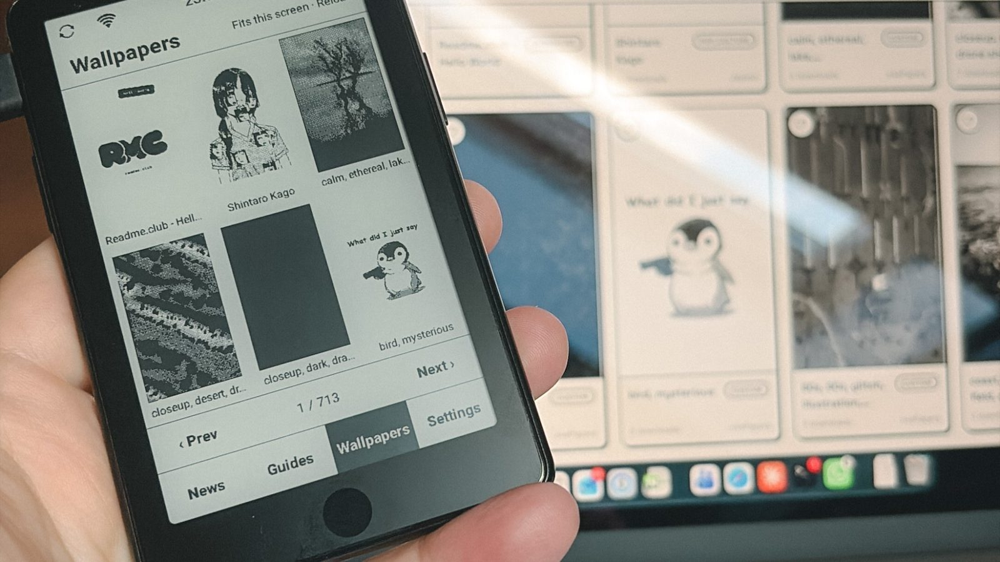

<div align="center">

<picture>
  <source media="(prefers-color-scheme: dark)" srcset="docs/assets/logo-dark.png">
  
</picture>

## Your e-ink reader just got its own club.

**readme.club is the first e-ink media with its own app for e-readers.**<br>
News, guides and thousands of wallpapers — right on the device, offline, in glorious black and white.

[](../../releases/latest)
[](LICENSE)


### [Download readmeclub.apk](../../releases/latest/download/readmeclub.apk)



<sub>The Wallpapers tab on an Xteink S4 — 700+ pages of wallpapers that fit the screen pixel for pixel.</sub>

</div>

---

## What's inside

| | |
|---|---|
| **News** | Fresh readme.club articles with their photos, saved for offline reading. A link to another article? It opens right in the app. |
| **Guides** | A real bookshelf: pick a brand, pick a guide, follow the steps — even with Wi-Fi off. |
| **Wallpapers** | 4,000+ community wallpapers, filtered to fit your screen exactly. One tap and the original lands in `Pictures/ReadmeClub`. |
| **Settings** | Text size, Sans or Serif, refresh rhythm, storage per section — and one-tap updates. |

## Made for e-ink, not squeezed onto it

- **Pages, never scrolling.** Everything is cut to the screen and turned like a book.
- **One button is all you need.** The capacitive button turns pages, a long press opens the menu. Prefer tapping? The screen edges work too.
- **Crisp black on white.** No animations, no spinners; touch feedback is a clean inversion, and a full refresh wipes ghosting every few pages.
- **Offline first.** One sync when you open the app, then everything reads from the device.
- **Never leaves the app.** E-readers rarely have a browser, so nothing ever links out.
- **Featherweight.** About 160 KB. Pure Kotlin, native Android views, zero third-party libraries.

Built and loved on the **Xteink S4** (Android 11, 4.3", 480 × 800), and made to run on other
Android 11+ e-readers too: the wallpaper gallery matches your screen through readme.club's
device registry, and both volume and page-turn buttons turn pages. Tested so far on the S4
only; reports from other readers are very welcome. Device notes: [docs/DEVICE.md](docs/DEVICE.md).

## Install in three steps

1. Download **[readmeclub.apk](../../releases/latest/download/readmeclub.apk)** onto your reader.
2. Open it and allow installing apps from this source when Android asks.
3. Enjoy. New versions show up as **Settings •** and install from **About → Update**.

Got a computer handy? `adb install -r readmeclub.apk` works too.

## Build it yourself

```sh
./gradlew testDebugUnitTest assembleDebug
adb install -r app/build/outputs/apk/debug/app-debug.apk
```

Debug builds install next to the official app as *readme.club dev*. Every push is built by
GitHub Actions; a `v*` tag publishes a signed release ([docs/RELEASE.md](docs/RELEASE.md)).

## Join in

Ideas, bug reports and pull requests are all welcome — this app grows with the community,
just like the site. The house rules live in [CLAUDE.md](CLAUDE.md): no dependency without a
reason, no animation, no scrolling, no link leaving the app, everything in English.

Not on the club yet? Grab a free member account at **[readme.club/member/join](https://www.readme.club/member/join)**

## License

[GPL-3.0](LICENSE), with additional terms in [NOTICE](NOTICE): any distributed version must
keep the attribution *“Based on readme.club for Android by Florent Bertiaux”*, and the
readme.club name, logo and icon are not licensed for use by modified versions.

<div align="center">
<br>
<sub>Made by the readme.club team, its volunteers and every reader who drops by.<br>
readme.club is independent and not affiliated with Xteink or any device brand.</sub>
</div>
